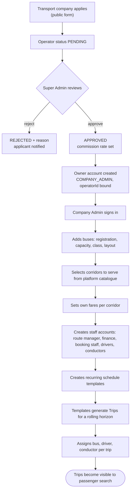
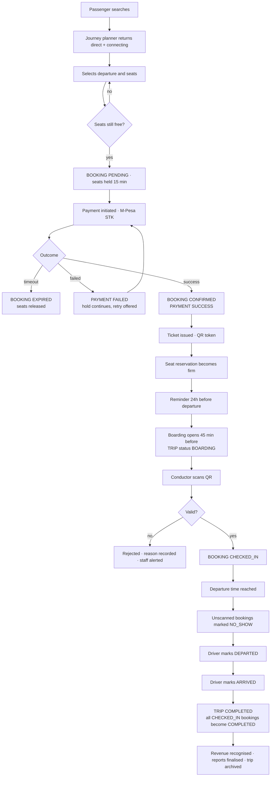
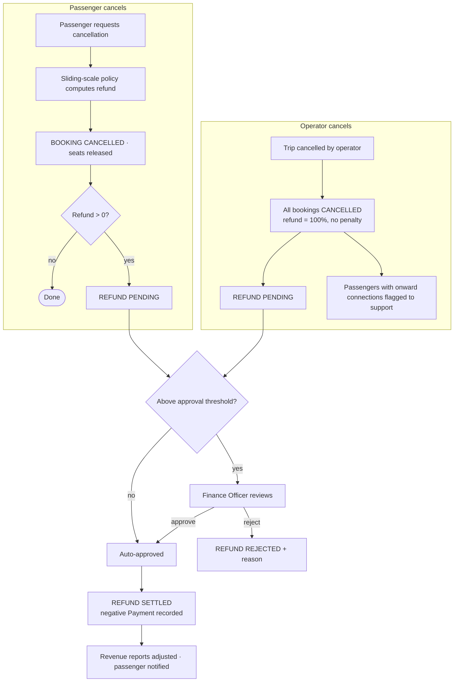

# SafiriConnect — Business Workflow Design Document

**Status:** approved and implemented. Phases 1–6 are built and verified; §8 records
what each phase delivered and how it was proved. Deviations found during
implementation are marked **[as built]**.
**Supersedes:** the defect analysis in `WORKFLOW.md`, which remains valid as the
record of what the system does today. This document says what it *should* do.

---

## 0. What kind of business is this?

Everything below depends on one distinction that the current codebase never
made, and it is the root of defect D2.

**SafiriConnect is a marketplace, not a bus company.** Fifteen operators —
Tahmeed, Easy Coach, Modern Coast, Mash Poa and the rest — sell through one
platform. That means there are two separate planes of authority:

| Plane | Owns | Example |
|---|---|---|
| **Platform** | operators, corridors, passengers, settlement rules | SafiriConnect staff |
| **Operator** | fleet, timetable, staff, own revenue | Easy Coach management |

Three consequences that shape every decision in this document:

1. **A passenger belongs to the platform, not to a company.** They book across
   operators — a Chuka → Bomet journey may involve two. `User.operatorId` is
   therefore *null* for passengers, and non-null only for staff.

2. **Routes are shared infrastructure; trips are private.** Nairobi–Mombasa is a
   corridor, not Easy Coach's property. Six operators run it. So `Route` stays
   platform-owned and unscoped, and operator ownership flows through
   `Trip → Bus → Operator`. This is already how the schema is shaped, and it is
   correct — it just was never enforced in queries.

3. **Fare is per-operator, not per-corridor.** `Route.baseFare` is a market
   reference anchor used for sanity-checking and estimation; `Trip.fare` is what
   this operator actually charges. Section 7 proposes making that explicit.

---

## 1. User roles

### 1.1 Summary

| Role | Plane | Scope of data | Count in a real deployment |
|---|---|---|---|
| `SUPER_ADMIN` | platform | everything | 2–3 people |
| `PLATFORM_SUPPORT` | platform | all bookings, no config | 3–10 |
| `COMPANY_ADMIN` | operator | own operator, all of it | 1–3 per operator |
| `ROUTE_MANAGER` | operator | own operator: timetable + fleet | 0–2 per operator |
| `FINANCE_OFFICER` | operator | own operator: money only | 0–2 per operator |
| `BOOKING_STAFF` | operator | own operator: bookings + boarding | 5–50 per operator |
| `CONDUCTOR` | operator | assigned trips only | 1 per bus |
| `DRIVER` | operator | assigned trips only | 1–2 per bus |
| `PASSENGER` | platform | own records only | unbounded |

Nine roles. Seven were requested; I am proposing `PLATFORM_SUPPORT` as an
addition and recommending `ROUTE_MANAGER` be **optional per operator** rather
than assumed. Both are justified in §1.3.

---

### 1.2 Role definitions

#### `SUPER_ADMIN` — platform operator

**Purpose.** Runs SafiriConnect itself. Decides which transport companies may
trade on the platform and on what terms.

| | |
|---|---|
| **Responsibilities** | Approve/suspend operators · set commission and settlement rules · manage platform staff · own the location and corridor catalogue · review the full audit trail · system configuration |
| **Permissions** | Everything, unscoped |
| **Restrictions** | Should *not* routinely create bookings or edit an operator's timetable — that is the operator's business and doing so muddies accountability. Possible, logged loudly, not routine. |
| **Daily workflow** | Review pending operator applications → check platform-wide occupancy and revenue → review flagged incidents (failed payments, disputed refunds, suspicious logins) → act on escalations from support |
| **Dashboard** | Platform GMV and commission · active operators · bookings today across all operators · operator league table · failed payment rate · new registrations · system health |
| **Notifications** | Operator applied · operator suspended · payment failure rate breaches threshold · repeated failed logins · refund above threshold · any `SUPER_ADMIN` action by another admin |
| **Reports** | Every report, unscoped, plus commission and settlement statements |

---

#### `PLATFORM_SUPPORT` — customer care *(proposed addition)*

**Purpose.** Answers the passenger whose journey spans two operators.

**Justification for adding it.** A passenger on Chuka → Nairobi → Bomet holds
two tickets from two companies. When leg one runs late and they miss leg two,
neither company owns the problem — each sees only its own booking. Today the
only account that can see both is `SUPER_ADMIN`, which means routine customer
care requires handing out the keys to the entire platform. That is a real
operational need *and* a security argument, so the role earns its place.

| | |
|---|---|
| **Responsibilities** | Look up any booking · cancel and initiate refunds within policy · re-issue tickets · escalate to an operator or to `SUPER_ADMIN` |
| **Permissions** | Read all bookings/passengers across operators · cancel and refund within a value ceiling · write case notes |
| **Restrictions** | No timetable, fleet, fare, user-management or configuration access. Refunds above the ceiling need `SUPER_ADMIN`. |
| **Daily workflow** | Work the case queue → handle missed-connection and failed-payment cases → escalate what policy does not cover |
| **Dashboard** | Open cases · today's failed payments · disrupted journeys (cancelled trip with onward connections) · refunds pending approval |
| **Notifications** | Trip cancelled with connecting passengers affected · payment stuck in PENDING beyond the hold · passenger-initiated dispute |
| **Reports** | Cancellation, refund, incident |

---

#### `COMPANY_ADMIN` — operator management

**Purpose.** Runs one transport company on the platform.

| | |
|---|---|
| **Responsibilities** | Fleet · timetable · fares · own staff · own revenue · service quality |
| **Permissions** | Full CRUD **scoped to own operator**: buses, trips, schedule templates, fares, staff accounts (all operator roles), own bookings, own reports |
| **Restrictions** | Cannot see any other operator's data — bookings, revenue, occupancy or fleet. Cannot create corridors (platform-owned) or platform staff. Cannot change another operator's fares. |
| **Daily workflow** | Morning: yesterday's revenue and occupancy, today's departures, any bus without a driver → midday: adjust capacity on filling routes, approve refunds → evening: confirm tomorrow's crew assignments, review no-shows |
| **Dashboard** | Revenue today/week/month vs prior · seats sold vs capacity (load factor) · departures today by status · unassigned crew warnings · top routes by revenue · cancellations and refunds · fleet utilisation · live booking feed |
| **Notifications** | Departure tomorrow with no driver *(critical)* · trip cancelled · refund above threshold pending approval · load factor below floor on a scheduled departure · bus maintenance due · daily revenue digest |
| **Reports** | All operator-scoped reports |

---

#### `ROUTE_MANAGER` — timetable and fleet *(optional per operator)*

**Purpose.** Owns what runs, when, and with which vehicle and crew.

**Why optional.** In most Kenyan operators this is the Operations Manager and is
the same person as the Company Admin. Forcing every company to fill the role
creates ceremony without control. It should exist as a *permission set* a large
operator can delegate — Modern Coast with 200 buses genuinely separates
scheduling from commercial management; a twelve-bus SACCO does not.

| | |
|---|---|
| **Responsibilities** | Schedule templates · daily departures · bus assignment · driver and conductor rostering · cancellations and disruption |
| **Permissions** | Own operator: create/edit trips and schedule templates, assign buses and crew, cancel departures, read own bookings and occupancy |
| **Restrictions** | Cannot change fares · cannot create or manage staff accounts · no revenue or payment data · cannot manage passengers |
| **Daily workflow** | Confirm today's departures have bus + driver + conductor → handle breakdowns by swapping vehicles → publish next week's generated schedule → review last week's punctuality |
| **Dashboard** | Departures next 48h with crew/vehicle status · unassigned trips · buses in maintenance · load factor by departure · punctuality |
| **Notifications** | Departure within 24h missing crew or bus · driver marked unavailable · trip departed late · bus flagged for maintenance |
| **Reports** | Fleet utilisation · route performance · punctuality · crew roster |

---

#### `FINANCE_OFFICER` — operator money

**Purpose.** Reconciles what was collected against what was owed.

| | |
|---|---|
| **Responsibilities** | Payment reconciliation · refund approval · revenue reporting · settlement against platform commission |
| **Permissions** | Own operator: read all payments, refunds, bookings (financial view) · approve/reject refunds · export financial reports |
| **Restrictions** | **Cannot modify a booking, trip or fare.** This is deliberate separation of duties — the person who approves a refund must not be able to alter the booking that justified it. No crew or fleet access. |
| **Daily workflow** | Reconcile yesterday's M-Pesa receipts against confirmed bookings → work the refund queue → investigate failed payments → month-end settlement statement |
| **Dashboard** | Collected today/week/month · pending refunds by age · failed payment value · reconciliation exceptions (payment without booking, booking without payment) · commission owed · average fare and revenue per seat |
| **Notifications** | Refund requested above threshold · reconciliation mismatch · unusually high failure rate · settlement statement ready |
| **Reports** | Payment · revenue · refund · reconciliation · commission/settlement · tax summary |

---

#### `BOOKING_STAFF` — counter and gate

**Purpose.** Sells and boards. The highest-volume operational role.

| | |
|---|---|
| **Responsibilities** | Book on a passenger's behalf at the counter · take counter payments · amend and cancel within policy · scan tickets at the gate · handle walk-ups |
| **Permissions** | Own operator: create bookings for any passenger · read own operator's bookings and manifests · scan/check in · cancel within policy window · read trip and seat availability |
| **Restrictions** | No fares · no fleet · no timetable · no user management · no revenue totals (transaction-level only) · **cannot see other operators' bookings** |
| **Daily workflow** | Open counter → sell to walk-ups → 45 min before each departure, open boarding and scan → mark no-shows at departure → close till and reconcile against the day's takings |
| **Dashboard** | Next departures from this station · seats remaining per departure · today's bookings I created · boarding progress for the departure in front of me · manifest for the current trip |
| **Notifications** | Departure boarding in 30 min · seats nearly sold out on the next departure · booking cancelled for a trip boarding now · payment failed on a booking I created |
| **Reports** | Own daily sales · till reconciliation · manifest (printable) |

---

#### `CONDUCTOR` — on-board

**Purpose.** Owns the passenger manifest for a specific trip.

| | |
|---|---|
| **Responsibilities** | Verify boarding passes · mark boarded/no-show · sell to en-route pickups where permitted · confirm final count to the driver |
| **Permissions** | **Assigned trips only**: read manifest, scan tickets, mark boarded/no-show, record en-route sale |
| **Restrictions** | Sees no trip they are not assigned to · cannot cancel a booking or issue a refund · no passenger contact details beyond name and seat · no financial data |
| **Daily workflow** | Receive assignment → 30 min before: open manifest, begin scanning → departure: mark no-shows, confirm count → en route: board pickups at intermediate stops → arrival: close manifest |
| **Dashboard** | Today's assigned trips · current manifest (seat, name, boarded status) · boarded vs expected count · seats free for en-route sale |
| **Notifications** | Assigned to a trip · assignment changed · booking added or cancelled for a trip within 2h of departure · trip cancelled |
| **Reports** | Own trip manifests · own boarding record |

---

#### `DRIVER`

**Purpose.** Operates the vehicle and owns the trip's real-world status.

**This is the role that closes a gap nothing else can.** `Trip.status` has
`DEPARTED` and `ARRIVED` values that **nothing in the system ever sets**. Until
the driver reports them, every arrival time in the platform is a scheduled
guess. That is defect D13, found while writing this document.

| | |
|---|---|
| **Responsibilities** | Confirm start of duty · report departure and arrival · report delay or breakdown · carry final passenger count |
| **Permissions** | Assigned trips only: read trip and passenger count, set `DEPARTED`/`ARRIVED`, report incident |
| **Restrictions** | No passenger names or contact details (count only — a driver has no operational need for a manifest, and the data minimisation is deliberate) · no bookings · no routes · no money |
| **Daily workflow** | Check assignments → report on duty → confirm bus → depart, mark departed → report delays → arrive, mark arrived |
| **Dashboard** | Today's assigned trips with departure times · assigned bus · passenger count · route and stops · one-tap Departed / Arrived / Report incident |
| **Notifications** | Assigned to a trip · assignment or vehicle changed · trip cancelled · departure in 60 min |
| **Reports** | Own trip history · own punctuality |

---

#### `PASSENGER`

| | |
|---|---|
| **Responsibilities** | Search, book, pay, travel |
| **Permissions** | Own bookings, tickets, payments, profile only |
| **Restrictions** | No operational tooling of any kind. Cannot see other passengers' details, including co-travellers on the same trip beyond their own booking. |
| **Daily workflow** | Search → compare → book → pay → receive ticket → board → travel |
| **Dashboard** | Upcoming journeys with boarding details · recent trips · total spent · saved travellers · notifications |
| **Notifications** | Seats held, pay within N minutes · payment received, ticket ready · payment failed · hold lapsed · **departure tomorrow reminder** · **trip cancelled or delayed** · refund issued |
| **Reports** | Own travel and spend history · downloadable receipts |

---

### 1.3 One more role, deliberately deferred

**`AGENT` — third-party ticket seller.** In Kenya a large share of long-distance
tickets sell through independent agents at stages who are not employees of any
one company. They sell for several operators, are paid commission, and hold no
company account. This is a genuine commercial role and its absence is a real
limitation of the design.

**Deferred because** it introduces commission accounting, agent float and
settlement, and multi-operator sales authority — a substantial subsystem that
would dominate the remaining work without improving what the examiner is being
asked to assess. Recorded here so the omission is a decision, not an oversight.

---

## 2. End-to-end business workflow

### 2.1 Operator onboarding



**A trip is only sellable when it has a bus, a driver, a conductor and a fare.**
Anything less is a draft, not a departure — selling a seat on a bus with no
driver is how a company strands passengers.

### 2.2 Booking and travel lifecycle



### 2.3 Cancellation and refund



**Why refunds get their own lifecycle.** Today the refund amount is written to
the booking and **no money movement is ever recorded** (defect D12), so
cancelled value silently stays in revenue. A refund is a financial transaction
with its own approval and settlement, not a field on a booking.

---

## 3. Event matrix

### 3.1 Notification classes

Every event is assigned a delivery class per role. This exists because
notifying every staff member of every booking does not scale — an operator
doing 500 bookings a day would send each clerk 500 messages, and the bell
becomes noise within a week.

**This is a correction to Phase 1 as built.** The event bus currently notifies
all staff individually on `booking.created` and `booking.confirmed`. It is
correct in structure and wrong in volume, and §8 schedules the fix.

| Class | Delivery | Use for |
|---|---|---|
| **P** Push | in-app + SMS/email | affects a person's journey or their money |
| **I** In-app | bell only | operationally relevant, act within hours |
| **G** Digest | aggregated hourly/daily | routine high-volume |
| **D** Dashboard | live counter, no message | anything a number can express |
| **A** Audit | written, surfaced on inspection | everything, always |

### 3.2 Core events

Columns: **Actor** · **Tables written** · **Dashboards** · **Reports** ·
**Notified** (role: class)

| Event | Actor | Tables | Dashboards | Reports | Notified |
|---|---|---|---|---|---|
| `COMPANY_APPLIED` | public | Operator | Super Admin | — | Super Admin **P** |
| `COMPANY_APPROVED` | Super Admin | Operator, User | Super Admin | Operator | Applicant **P** |
| `COMPANY_SUSPENDED` | Super Admin | Operator, Trip | Super Admin, Company Admin | Operator | Company Admin **P**, its staff **I** |
| `USER_REGISTERED` | public | User, Session | Super Admin | Passenger growth | Passenger **P**, Super Admin **G** |
| `STAFF_INVITED` | Company Admin | User | Company Admin | Staff | Invitee **P** |
| `USER_ROLE_CHANGED` | Admin | User | Super Admin | Audit | Subject **P**, Super Admin **I** |
| `BUS_ADDED` | Company Admin | Bus | Company Admin, Route Manager | Fleet | Route Manager **I** |
| `BUS_MAINTENANCE_DUE` | system | Bus | Route Manager | Fleet | Route Manager **P**, Company Admin **I** |
| `ROUTE_CREATED` | Super Admin | Route | Super Admin | Network | Company Admins **I** |
| `FARE_CHANGED` | Company Admin | Route/OperatorFare, FareHistory | Company Admin, Finance | Revenue, fare history | Finance **I**, Booking Staff **I** |
| `SCHEDULE_CREATED` | Route Manager | ScheduleTemplate | Route Manager | — | Company Admin **I** |
| `TRIPS_GENERATED` | system | Trip | Route Manager, Company Admin | Fleet | Route Manager **G** |
| `TRIP_CREATED` | Route Manager | Trip | Route Manager, search | Route perf. | — **D** |
| `CREW_ASSIGNED` | Route Manager | Trip | Route Manager, Driver, Conductor | Crew roster | Driver **P**, Conductor **P** |
| `TRIP_UNCREWED` | system | — | Route Manager, Company Admin | — | Route Manager **P**, Company Admin **P** |
| `TRIP_CANCELLED` | Route Manager | Trip, Booking, Refund | all operator dashboards | Cancellation | Passengers **P**, Driver **P**, Conductor **P**, Booking Staff **I**, Finance **I**, Support **I** |
| `BOOKING_CREATED` | Passenger / Staff | Booking, BookingSeat, Trip | Company Admin, Booking Staff | Booking | Passenger **P**, Booking Staff **D** |
| `BOOKING_CONFIRMED` | system (on payment) | Booking, Payment, Ticket | all operator dashboards | Booking, revenue, occupancy | Passenger **P**, Booking Staff **D**, Company Admin **G**, Finance **D**, Conductor **I**\* |
| `BOOKING_EXPIRED` | system | Booking, BookingSeat, Trip | Booking Staff | Conversion | Passenger **P**, Booking Staff **D** |
| `BOOKING_CANCELLED` | Passenger / Staff / Support | Booking, BookingSeat, Trip, Refund | all operator dashboards | Cancellation, revenue | Passenger **P**, Booking Staff **I**\*, Conductor **I**\*, Finance **D** |
| `PAYMENT_INITIATED` | Passenger | Payment | Finance | Payment | — **D** |
| `PAYMENT_SUCCEEDED` | system | Payment, Booking | Company Admin, Finance | Revenue, payment | folds into `BOOKING_CONFIRMED` |
| `PAYMENT_FAILED` | system | Payment | Finance, Booking Staff | Payment failure | Passenger **P**, Finance **G**, Booking Staff **I**\* |
| `REFUND_REQUESTED` | system | Refund | Finance | Refund | Finance **I** (**P** above threshold) |
| `REFUND_APPROVED` | Finance | Refund | Finance, Company Admin | Refund, revenue | Passenger **P** |
| `REFUND_SETTLED` | system | Refund, Payment | Finance, Company Admin | Revenue, settlement | Passenger **P**, Finance **D** |
| `TICKET_ISSUED` | system | Ticket | — | — | folds into `BOOKING_CONFIRMED` |
| `TICKET_SCANNED` | Conductor / Staff | Ticket, Booking | Conductor, Booking Staff, Company Admin | Boarding | — **D** |
| `TICKET_REJECTED` | Conductor / Staff | AuditLog | Conductor, Booking Staff | Incident | Booking Staff **I** |
| `TRIP_BOARDING` | system (T−45m) | Trip | Conductor, Booking Staff | — | Conductor **P**, Booking Staff **I** |
| `TRIP_DEPARTED` | Driver | Trip | Route Manager, Company Admin | Punctuality | Route Manager **D** (**I** if late) |
| `NO_SHOW_RECORDED` | system (at departure) | Booking | Company Admin, Finance | No-show, revenue | — **D** |
| `TRIP_ARRIVED` | Driver | Trip | Route Manager | Punctuality | Route Manager **D** |
| `TRIP_COMPLETED` | system | Trip, Booking | all operator dashboards | all operational | Passenger **I** (rate your trip) |
| `LOGIN_FAILED` ×5 | system | AuditLog | Super Admin | Security | Account owner **P**, Super Admin **I** |

\* **only when the departure is within 2 hours.** A cancellation three weeks out
is a dashboard number; the same cancellation ninety minutes before boarding is
something the conductor must be told, because they are about to look for that
passenger. Time-to-departure is the difference between signal and noise.

**Every event writes `AuditLog`. Without exception.**

---

## 4. Dashboard matrix

| Dashboard | Audience | Contents | Source | Refresh |
|---|---|---|---|---|
| **Platform overview** | Super Admin | GMV, commission, active operators, bookings today, operator league table, failure rate, registrations | aggregate across all operators | SSE + 60 s poll |
| **Support queue** | Support | open cases, today's failed payments, disrupted journeys, refunds pending | Booking, Payment, Refund | SSE |
| **Operator overview** | Company Admin | revenue (today/week/month + prior), load factor, departures by status, uncrewed warnings, top routes, cancellations, live booking feed | scoped to operator | SSE + 30 s poll |
| **Operations board** | Route Manager | departures next 48h with crew/vehicle state, unassigned trips, maintenance, load factor, punctuality | Trip, Bus, User | SSE |
| **Finance** | Finance Officer | collected today/week/month, refunds by age, failed value, reconciliation exceptions, commission owed, revenue per seat | Payment, Refund, Booking | SSE + 60 s poll |
| **Counter** | Booking Staff | next departures from this station, seats remaining, my bookings today, boarding progress, current manifest | Trip, Booking | SSE |
| **Manifest** | Conductor | assigned trips, manifest with boarded state, boarded vs expected, seats free for pickup | BookingSeat for trip | SSE |
| **Driver** | Driver | today's trips, assigned bus, passenger count, stops, Departed/Arrived actions | Trip | SSE + 60 s poll |
| **Passenger** | Passenger | upcoming journeys, recent trips, total spent, notifications | own Booking, Payment | SSE |

**Two rules for every dashboard.**

**One query, one truth.** No dashboard computes a figure a report computes
differently. Occupancy is defined once, in one module, and everything reads it.
This is the lesson of the calendar/search split — two implementations of one
question will always drift, and the second one to be written is always the one
that is wrong.

**SSE with a polling floor.** The stream pushes invalidations; the poll is a
safety net for a dropped connection. A dashboard that silently stops updating is
worse than one that never claimed to.

---

## 5. Notification matrix

Rows are events, columns are roles, cells are delivery class (§3.1).
`—` means deliberately nothing.

| Event | Passenger | Booking Staff | Company Admin | Route Mgr | Driver | Conductor | Finance | Support | Super Admin |
|---|---|---|---|---|---|---|---|---|---|
| Booking created | **P** | **D** | **D** | — | — | — | — | — | — |
| Booking confirmed | **P** | **D** | **G** | — | — | **I**\* | **D** | — | — |
| Booking expired | **P** | **D** | — | — | — | — | — | — | — |
| Booking cancelled | **P** | **I**\* | **G** | — | — | **I**\* | **D** | — | — |
| Payment failed | **P** | **I**\* | — | — | — | — | **G** | **I** | — |
| Refund requested | **I** | — | **D** | — | — | — | **I**/**P** | — | — |
| Refund settled | **P** | — | **D** | — | — | — | **D** | — | — |
| Trip cancelled | **P** | **I** | **P** | **P** | **P** | **P** | **I** | **I** | — |
| Crew assigned | — | — | **D** | **D** | **P** | **P** | — | — | — |
| Trip uncrewed (T−24h) | — | — | **P** | **P** | — | — | — | — | — |
| Boarding opened | **I** | **I** | — | **D** | **I** | **P** | — | — | — |
| Ticket scanned | — | **D** | **D** | — | **D** | **D** | — | — | — |
| Ticket rejected | — | **I** | **D** | — | — | **I** | — | — | — |
| Trip departed | — | **D** | **D** | **D**/**I** | — | — | — | — | — |
| Trip completed | **I** | **D** | **D** | **D** | — | — | **D** | — | — |
| Departure tomorrow | **P** | — | — | — | **I** | **I** | — | — | — |
| Maintenance due | — | — | **I** | **P** | — | — | — | — | — |
| Fare changed | — | **I** | **D** | — | — | — | **I** | — | — |
| Company applied | — | — | — | — | — | — | — | — | **P** |
| 5× failed logins | **P**† | — | — | — | — | — | — | — | **I** |
| Daily revenue digest | — | — | **G** | — | — | — | **G** | — | **G** |

\* within 2h of departure only  †  to the account owner

**Principles.**

1. **Money and journeys push; everything else pulls.** If it changes where
   someone will be or what they will pay, it interrupts them. Otherwise it is a
   number on a screen.
2. **Never notify the actor of their own action.** A clerk who cancels a booking
   does not need to be told it was cancelled.
3. **Aggregate the routine.** A company admin gets one evening digest of the
   day's trade, not four hundred interruptions.
4. **Urgency is a function of time-to-departure**, not of event type.

---

## 6. Reporting matrix

| Report | Purpose | Roles | Filters | Format | Timeliness |
|---|---|---|---|---|---|
| **Booking** | every booking with status and value | Company Admin, Finance, Booking Staff (own), Super Admin | date, route, status, operator\*, staff, channel | XLSX, CSV, PDF | live |
| **Revenue** | gross, net of refunds, commission | Company Admin, Finance, Super Admin | date, route, class, operator\* | XLSX, PDF | live |
| **Payment** | transactions incl. failures | Finance, Super Admin | date, method, status | XLSX, CSV | live |
| **Reconciliation** | payments vs bookings, exceptions | Finance | date | XLSX | nightly + on demand |
| **Refund** | requested/approved/settled, ageing | Finance, Company Admin, Support | date, status, reason | XLSX, PDF | live |
| **Cancellation** | who cancelled, when, why, cost | Company Admin, Finance, Support | date, initiator, route | XLSX, PDF | live |
| **Occupancy / load factor** | seats sold vs offered | Company Admin, Route Manager | date, route, departure time, class | XLSX, PDF | live |
| **Route performance** | revenue, load, punctuality per corridor | Company Admin, Route Manager, Super Admin | date, route | XLSX, PDF | live |
| **Fleet utilisation** | trips, km, revenue, idle days per bus | Company Admin, Route Manager | date, bus, class | XLSX | live |
| **Punctuality** | scheduled vs actual departure/arrival | Route Manager, Company Admin | date, route, driver | XLSX | live |
| **Crew roster** | assignments and hours | Route Manager, Company Admin | date range, person | XLSX, PDF | live |
| **Manifest** | boarding list for one departure | Booking Staff, Conductor, Driver (count only) | trip | **PDF** | live |
| **No-show** | booked, paid, did not board | Company Admin, Finance | date, route | XLSX | live |
| **Passenger travel history** | own journeys and spend | Passenger | date | PDF | live |
| **Daily operations** | end-of-day summary | Company Admin, Route Manager | date | PDF | nightly |
| **Monthly analytics** | trends, growth, seasonality | Company Admin, Super Admin | month, route | PDF, XLSX | monthly |
| **Commission / settlement** | platform fee, amount due | Finance, Super Admin | period, operator\* | PDF, XLSX | monthly |
| **Audit** | full action history | Super Admin (all), Company Admin (own) | date, user, action, entity | CSV | live |

\* operator filter available to platform roles only; operator roles are scoped
automatically and cannot widen it.

**Every report is a view over live tables — no report tables, no nightly
snapshots to drift out of date.** The two marked "nightly" are *delivered* on a
schedule; they are still computed from live data when opened.

---

## 7. Database review

### 7.1 New tables

| Table | Purpose | Key columns |
|---|---|---|
| `ScheduleTemplate` | recurring timetable; generates trips | operatorId, routeId, busId?, driverId?, conductorId?, daysOfWeek, departureTime, fare, validFrom, validTo, isActive |
| `Refund` | refund as a transaction with a lifecycle | bookingId, paymentId, amount, reason, status (REQUESTED/APPROVED/REJECTED/SETTLED), requestedBy, reviewedBy, reviewedAt, settledAt |
| `TripCrew` *(or fields on Trip)* | driver + conductor per trip | tripId, userId, role, assignedBy, assignedAt |
| `OperatorRoute` | which corridors an operator serves, at what fare | operatorId, routeId, baseFare, isActive |
| `SupportCase` | customer-care thread | bookingId?, passengerId, openedBy, status, category, notes, resolvedAt |
| `Notification` *(exists)* | + `category`, `severity`, `groupKey` for digests | |

### 7.2 Modified tables

| Table | Change | Why |
|---|---|---|
| `User` | **+ `operatorId String?`** | **the fix for D2.** Null = platform-level |
| `User` | + `invitedBy`, `invitedAt`, `lastSeenAt` | staff lifecycle |
| `Role` enum | → 9 values (§1.1) | fixes D3 |
| `Operator` | + `status` (PENDING/APPROVED/SUSPENDED/REJECTED), `ownerId`, `commissionRate`, `appliedAt`, `approvedAt`, `approvedBy` | onboarding workflow |
| `Trip` | + `conductorId`, `actualDepartureAt`, `actualArrivalAt`, `scheduleTemplateId?` | crew + punctuality + D13 |
| `Booking` | + `channel` (ONLINE/COUNTER/AGENT), `createdByStaffId?` | counter sales attribution |
| `BookingSeat` | + `boardedAt`, `boardedBy`, `noShow` | per-seat boarding, not per-booking |
| `Payment` | + `kind` (CHARGE/REFUND) | refunds as movements, not status flips |
| `Bus` | + `nextServiceDueAt`, `odometerKm` | maintenance events |
| `AuditLog` | + `operatorId?` | lets a Company Admin read their own audit safely |

### 7.3 Relationships

```
Operator 1─* User          (staff; null for passengers and platform staff)
Operator 1─* Bus
Operator 1─* OperatorRoute *─1 Route
Operator 1─* ScheduleTemplate
ScheduleTemplate 1─* Trip
Trip *─1 Bus, *─1 Route, *─1 Driver(User), *─1 Conductor(User)
Trip 1─* Booking 1─* BookingSeat
Booking 1─* Payment  (kind CHARGE or REFUND)
Booking 1─* Refund
Booking 1─1 Ticket
```

### 7.4 Indexes and constraints

**New indexes**

- `User(operatorId, role)` — every scoped staff query
- `Trip(driverId, departureAt)`, `Trip(conductorId, departureAt)` — crew dashboards
- `Refund(status, requestedAt)` — finance queue ageing
- `ScheduleTemplate(operatorId, isActive)` — generation runs
- `Booking(createdByStaffId, createdAt)` — till reconciliation
- `AuditLog(operatorId, createdAt)` — operator-scoped audit

**Constraints**

- `@@unique([tripId, seatNumber])` on `BookingSeat` — **keep, unchanged.** This
  is what makes double-booking impossible; it is the single most important line
  in the schema.
- `@@unique([operatorId, routeId])` on `OperatorRoute`
- `@@unique([tripId, userId, role])` on `TripCrew`
- **Application-level invariant:** a staff user must have `operatorId`; a
  passenger and platform staff must not. Not expressible in SQL — enforced in
  one validation function and tested.

### 7.5 Migration risks

| Risk | Severity | Mitigation |
|---|---|---|
| Existing `ADMIN`/`STAFF` values are not in the new enum | **high** | Map before altering: `ADMIN → SUPER_ADMIN`, `STAFF → BOOKING_STAFF`. SQLite rewrites the table on enum change; verify row counts before and after. |
| Every existing staff user has `operatorId = null` and would see nothing | **high** | Assign each seeded staff account to an operator in the same migration. Fail the migration if any staff row is left unassigned. |
| Trips exist with no conductor and no driver | medium | Backfill from seed; mark unassignable trips as drafts rather than inventing crew. |
| Refunds already written to `Booking.refundAmount` | medium | Backfill a `Refund` row per non-null value, status `SETTLED`, so historic revenue reconciles. |
| Queries not yet operator-scoped leak data after roles split | **high** | Scoping helper is added *before* the roles are used, with a test that every staff-facing endpoint refuses cross-operator reads. |
| Local dev database is 163 MB and reseeds in ~4 min | low | Approved. Demo credentials are recreated unchanged. |

### 7.6 Data migration strategy

Development is a **destructive reseed** — approved, and the seed already
produces a richer dataset than any incremental migration could.

The production path is written and rehearsed anyway, because "we would have
done it differently in production" is exactly the question an examiner asks:

1. Additive migration — new nullable columns and tables only, no drops.
2. Backfill script — role mapping, `operatorId` assignment, `Refund` rows.
3. Verification — assert no staff user without an operator, no orphaned crew,
   revenue totals identical before and after.
4. Enforce — apply NOT NULL and the new constraints.
5. Remove dead columns in a later release, once nothing reads them.

Every step is reversible up to (4).

---

## 8. Implementation plan

Each phase is independently testable and leaves the system working.

| # | Phase | Delivers | Fixes | Migration | Verified by |
|---|---|---|---|---|---|
| **1** | Event bus | events, audit, role-routed notifications | D1 D4 D6 D8 D11 | none | `workflow-check.ts` ✔ |
| **1b** | Notification policy | delivery classes, digests, 2-hour urgency rule, self-action suppression | volume defect in §3.1 | none | `workflow-check.ts` ✔ |
| **2** | Roles + operator scoping | 9 roles, `User.operatorId`, capability guards, per-company staff | **D2 D3** | done + reseeded | `scope-check.ts` ✔ 18/18 |
| **3** | Live dashboards | SSE stream, operator-filtered, polling floor | D5 | none | `live-check.ts` ✔ |
| **4** | Crew and manifests | crew board, manifest, per-seat boarding, `DEPARTED`/`ARRIVED` | D7 D10 **D13** | none | `lifecycle-check.ts` ✔ 21/21 |
| **5** | Finance | `Refund` lifecycle, approval, negative settlement payment | D12 | none | `lifecycle-check.ts` ✔ |
| **6** | Scheduling | `ScheduleTemplate`, idempotent generation, admin screen | outstanding since turn 6 | none | build ✔, screen live |
| **7** | Reporting | the §6 matrix, scoped and exportable | D9 | none | **not built — see below** |

### [as built] What differs from this document

Recorded honestly rather than quietly:

1. **`AGENT` remains unbuilt**, as planned in §1.3.
2. **Phase 7 reporting is partial.** Analytics, bookings and the XLSX export are
   operator-scoped and live; the dedicated reconciliation, punctuality, no-show
   and commission reports in §6 are not built. The data all exists — every one
   is a query away — but the screens do not.
3. **D9 (analytics and the passenger dashboard computing the same facts twice)
   is only half closed.** `/api/analytics` is now scoped and authoritative; the
   passenger dashboard still runs its own small aggregates. They do not currently
   disagree, because they answer different questions, but the duplication that
   caused the calendar/search split is still present in miniature.
4. **Operator onboarding is modelled, not exposed.** `Operator.status`,
   `ownerId`, `commissionRate` and the `operator.applied` / `operator.approved`
   events all exist; the public application form and the super-admin approval
   screen do not. Seeded operators are created `APPROVED`.
5. **A bug this document caused.** Suppressing self-notification (§5, principle
   2) initially swallowed every passenger receipt, because the passenger is the
   actor on their own booking. Receipts now bypass the rule deliberately; the
   principle applies to awareness traffic only.

**Sequencing rationale.** Phase 2 comes early despite being the riskiest,
because scoping is a *cross-cutting concern* — every query written after it is
written correctly, and every query written before it has to be revisited. The
longer it waits, the more code has to change. Phase 1b comes first only because
it is small and the noise gets worse with every phase that adds events.

---

## 9. Decisions needing your sign-off

1. **Nine roles**, adding `PLATFORM_SUPPORT` and making `ROUTE_MANAGER`
   optional per operator (§1.2, §1.3).
2. **`AGENT` deferred** — the one genuinely missing commercial role (§1.3).
3. **Routes stay platform-owned and shared**; operators attach to them via
   `OperatorRoute` with their own fare (§0, §7.1).
4. **Drivers see a passenger count, never a manifest** — data minimisation
   (§1.2).
5. **Notification classes over per-event notification** — the correction to
   Phase 1 as built (§3.1, §5).
6. **Refunds become transactions** with approval and settlement, not a field
   (§2.3, §7.2).
7. **A trip without bus, driver, conductor and fare is not sellable** (§2.1).
