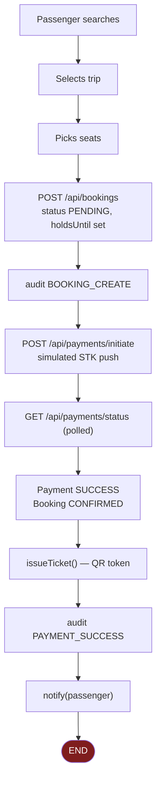
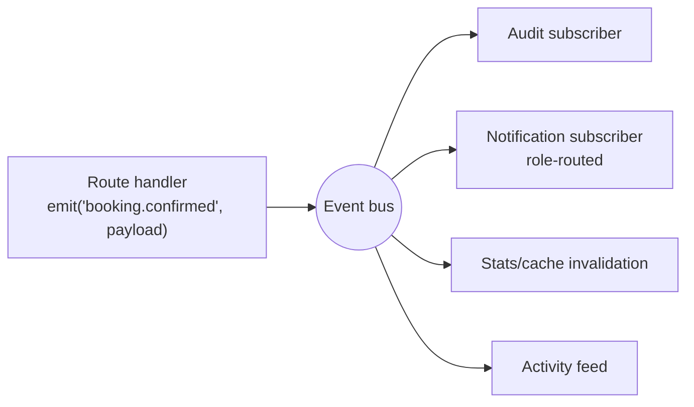
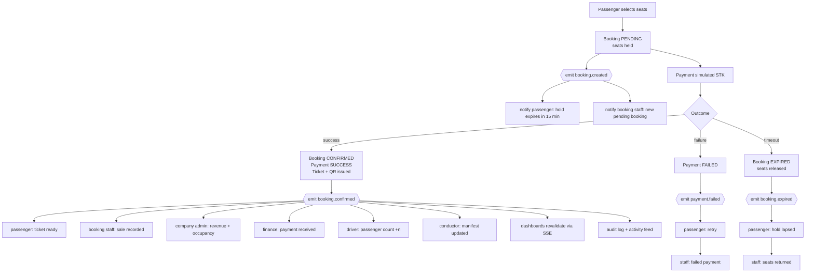

# Business workflow analysis and redesign

Written before any code changed. Everything in "Part 1" and "Part 2" is what the
system does **today**, verified by reading every route handler, page and model —
not what it was intended to do. Part 3 onward is the proposed redesign.

---

## Part 1 — What exists today

### Roles

`prisma/schema.prisma` defines exactly three:

```
enum Role { PASSENGER  STAFF  ADMIN }
```

There is no Driver, Conductor, Finance Officer or Route Manager. There is no
Company Admin — and, as Part 2 explains, there presently **cannot** be one.

### Pages (18)

| Area | Pages |
|---|---|
| Public | `/`, `/search`, `/login`, `/register` |
| Passenger | `/dashboard`, `/bookings`, `/bookings/[id]`, `/trips/[id]`, `/checkout/[id]`, `/profile` |
| Staff / Admin | `/admin`, `/admin/bookings`, `/admin/trips`, `/admin/buses`, `/admin/routes`, `/admin/users`, `/admin/checkin`, `/admin/audit` |

### API surface (30 handlers) and its guards

| Guard | Endpoints |
|---|---|
| Public | `journeys`, `availability`, `locations`, `operators`, `trips` (GET), `auth/login`, `auth/register` |
| `requireUser` | `bookings`, `bookings/[id]`, `bookings/[id]/cancel`, `payments/initiate`, `payments/status`, `notifications`, `profile`, `tickets/[id]/pdf`, `auth/password` |
| `requireStaff` | `analytics`, `buses`, `routes`, `trips` (POST/PATCH/DELETE), `checkin`, `export/bookings`, `users` (GET) |
| `requireAdmin` | `audit`, `users` (POST), `users/[id]` |

Endpoint-level RBAC is genuinely enforced server-side. The problem is not that
guards are missing — it is what they *cannot* express (Part 2).

### Data model (16 models)

`User · Session · Operator · Bus · Location · Route · FareRule · FareHistory ·
Trip · Booking · BookingSeat · Payment · Ticket · AuditLog · Notification ·
Setting`

Ownership chain today: `Operator → Bus → Trip → Booking → Payment → Ticket`.

### Current booking flow, as actually implemented



The flow **stops** at the passenger. Nothing downstream of `L` happens.

### Notification reality

Four call sites in the entire codebase:

| Site | Recipient |
|---|---|
| `auth/register` | the new user |
| `payments/status` (success) | the passenger |
| `bookings/[id]/cancel` | the passenger |
| `trips/[id]` (cancellation) | affected passengers — the only multi-recipient case |

### Real-time reality

Three polls, all client-side, all passenger-facing:

| Component | Interval | Purpose |
|---|---|---|
| `site-header` | 60 s | notification bell |
| `seat-picker` | 20 s | seat map freshness |
| `checkout` | ~3 s | payment status |

`admin-overview` fetches `/api/analytics` **once on mount** and never again.
Every admin table is the same. There is no SSE, no WebSocket, no revalidation
channel, no shared cache invalidation.

---

## Part 2 — Workflow defects found

Ordered by severity. Each was confirmed by reading the code, not inferred.

### D1 — Staff and admins are never notified of anything *(critical)*

Zero notifications are sent to STAFF or ADMIN anywhere in the system. A booking
worth KSh 4,500 is created, paid and ticketed, and no operational user learns of
it. `bookings/route.ts` POST audits the event and returns.

### D2 — Operator data is not scoped, so "Company Admin" cannot exist *(critical, structural)*

`User` has **no `operatorId`**. `Operator` relates only to `Bus`. Consequently a
STAFF user at Easy Coach can list, edit and delete Modern Coast's buses, trips
and bookings, and `/api/analytics` returns whole-platform revenue to any staff
member of any company. This is the single largest gap; no permission patch fixes
it without a schema change.

### D3 — `Trip.driverId` points at a role that does not exist *(structural)*

The schema has `driverId → User` with relation `TripDriver`, but `Role` has no
`DRIVER`. Any user can be assigned. No driver dashboard, no manifest endpoint,
no conductor concept at all.

### D4 — Booking creation notifies nobody, not even the passenger

The passenger's first notification arrives only on payment success. A hold that
expires unpaid is silent at both ends.

### D5 — Dashboards never refresh

A booking made in one tab is invisible in an admin tab until manual reload. This
is exactly what your three-tab screenshot shows. Total bookings, revenue,
occupancy and the activity feed are all mount-time snapshots.

### D6 — Expired holds are swept but nothing is announced

Seats return to the pool with no notification to the passenger who lost them and
no signal to staff.

### D7 — Check-in updates nothing beyond the booking row

`POST /api/checkin` sets `checkedInAt` and `status = CHECKED_IN`, audits, and
returns. No driver count, no conductor manifest, no boarding progress anywhere.

### D8 — Payment failure is silent

`payments/status` notifies on SUCCESS only. A failed or timed-out STK push
leaves the passenger with a PENDING booking and no message.

### D9 — Analytics and the passenger dashboard compute the same facts twice

`/api/analytics` uses raw SQL over `Payment`; `/dashboard` uses separate Prisma
aggregates. Same defect class as the calendar/search split already fixed — two
implementations of one question, free to drift.

### D10 — No manifest, no boarding list, no daily operations view

Nothing in the system answers "who is on this bus". This is the core operational
artefact of a transport business and it is absent.

### D11 — Audit log is written but never surfaced operationally

28 call sites write `AuditLog` faithfully. It is exposed only as a raw admin
table — it feeds no activity timeline, no dashboard, no per-entity history.

### D12 — Refunds are calculated but never move

`bookings/[id]/cancel` computes `refundAmount` via the sliding scale and writes
it to the booking. No `Payment` row of status `REFUNDED` is ever created, so
cancelled money is invisible to revenue reporting.

---

## Part 3 — Proposed architecture

Three additions carry almost all of the redesign.

### 3.1 A domain-event bus (`src/lib/events.ts`)

Today each route handler decides for itself what to audit and whom to notify,
which is why coverage is uneven. Instead, handlers emit one event; subscribers
decide the consequences.



One place to answer "who hears about this", and adding a role means adding a
routing rule, not editing twenty handlers.

Event catalogue: `booking.created · booking.confirmed · booking.cancelled ·
booking.expired · payment.succeeded · payment.failed · payment.refunded ·
ticket.issued · ticket.scanned · trip.created · trip.cancelled · trip.departed ·
bus.assigned · driver.assigned · fare.changed · user.registered · user.role_changed`

### 3.2 Operator scoping

```prisma
model User {
  operatorId String?     // null = platform-level (SUPER_ADMIN)
  operator   Operator?   @relation(fields: [operatorId], references: [id])
}
```

Plus a `scopeToOperator(user)` helper that every staff-facing query passes
through. Without this, "Company Admin" and per-company reporting are unbuildable.

### 3.3 Live dashboards via SSE

One endpoint, `GET /api/stream`, holding an SSE connection per session. The
event bus pushes role-filtered messages; clients revalidate the affected query.
Chosen over WebSockets because it is one-directional, survives the Next.js
runtime without a second server, and needs no new dependency.

Polling fallback stays for the notification bell.

### 3.4 Proposed roles

| Role | Scope | Responsibilities | Cannot |
|---|---|---|---|
| `SUPER_ADMIN` | platform | operators, users, system settings, full audit | — |
| `COMPANY_ADMIN` | own operator | own fleet, routes, trips, staff, revenue | see other operators |
| `BOOKING_STAFF` | own operator | create/amend bookings, check-in, manifests | change fares, manage users |
| `FINANCE_OFFICER` | own operator | payments, refunds, revenue reports | modify trips or bookings |
| `DRIVER` | assigned trips | own manifest, passenger count, trip status | anything else |
| `CONDUCTOR` | assigned trips | manifest, scan tickets, mark boarded | modify bookings |
| `PASSENGER` | own records | search, book, pay, cancel, own tickets | all operational tooling |

`ADMIN → SUPER_ADMIN` and `STAFF → BOOKING_STAFF` on migration.

### 3.5 Target booking lifecycle



---

## Part 4 — Delivery plan

Each phase ships verified before the next begins.

| # | Phase | Fixes | Migration |
|---|---|---|---|
| 1 | Event bus + audit/notification subscribers | D1 D4 D6 D8 D11 | none |
| 2 | Roles + operator scoping | D2 D3 | schema + reseed |
| 3 | SSE live dashboards | D5 | none |
| 4 | Manifests, driver & conductor views | D7 D10 | none |
| 5 | Finance: refunds, unified reporting | D9 D12 | none |

Phase 1 delivers most of the visible integration and needs no database change.
Phase 2 is the structural one and requires a reseed.
